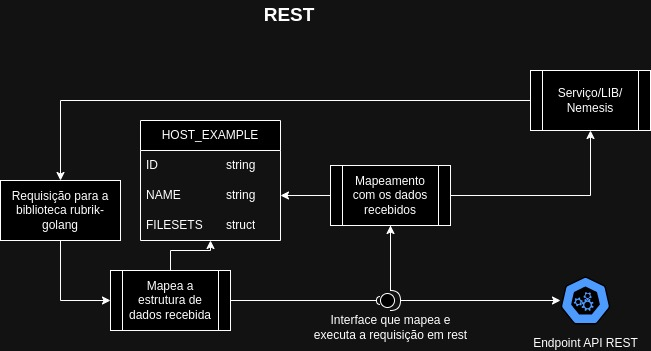
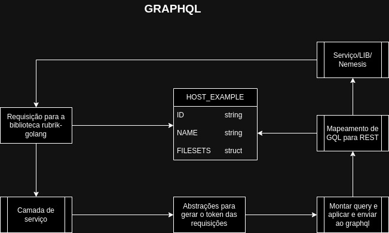

# **Rubrik 9 - Atualizaçãod dee Rest para GraphQL - Contexto Nemesis e Libs**

**Contextualizando ...**

- A alteração de todas as requisições rest's para graphql, foi necessário pois na atualização do rubrik para a versão 9, o rest perderá o suporte por parte da rubrik, o que inviabiliza o rest para as requisições.

---

- [X] **Status do documento: *Em andamento***

---

**Tarefas em andamento (dev team):**
 **Dev Team (Gabriel)**: Contexto de Snapshots

- **Dev Team (João)**: Contexto de Event Series
- **Dev Team (Jonathan)**: Contexto de Filesets
- **Backup Team (Besen)**: Apoio geral
- **Backup Team (Besen)**: Montagem do de-para do contexto de virtual-machines

---

Este documento serve como guia para tratar o que foi feito até o momento para a atualização da biblioteca - **rubrik-golang**, que é a biblioteca que recebe as requisições do ***nemesis***, e microsserviço, e executa os recursos no ***rubrik***, funcionando como centralizadora das requisições do ***rubrik*** e ***nemesis*** (contexto).

Contextos testados nos ambientes **local e hml**:

- **Hosts**
- **Logs**
- **SLA Domains**

---

Documento base para mapeamento dos endpoints:
[Rubrik goland endpoints](https://github.com/totvs-cloud/rubrik-end-points/blob/main/README.md)

---

Foi criado uma pasta chamada ***rubrikgql*** na raiz do ***projeto rubrik-goland***, nela colocamos tudo aquilo que foi possível refatorar e abstrair, sem alterar a estrutura, fazendo com o que use a ***rubrik-golang***, tenha o minimo de alteração.
Estrutura dos componentes:

- **rubrikgql**
  - **abstracts:** recebe os componentes que serão utilizados em diversos momento da execução de tarefas, como requisições http, fluxo para mais de um contexto, etc.
  - **enums:** estrutura de dados que recebe constantes.
  - **mappers:** transformar dados de um tipo para outro.
  - **models:** recebe representações das entidades de negócio, como respostas e mapeamento de dados para enviar e receber do rubrik ou entregar para algum serviço, repositório, etc.
  - **schemas:**
    - *generics*: recebe estruturas de dados usadas normalmente em abstrações para que seja usado em diversos momentos do projeto.
    - *queries*: recebe todas as queries do ***GraphQL*** .
  - **services:** recebe toda a regra de negócio possível de ser abstraida da raiz do projeto, segregando em uma camada para melhor ordenação e controle.
  - **utils:** todo o ferramental do projeto, recebendo funções que são usadas em diversos fluxos, como formatação de um dado, algum mapeamento, etc.

---

Na raiz do projeto possui arquivos, que são responsaveis por chamar todas os componentes descritos a cima.
Por convenção interna decidimos seguir uma estrutura, sendo ela:

- **arquivo.go**: arquivo que não pode ser alterado para não impactar o fluxo atual, esse arquivo contém o inicio de todo fluxo daquele contexto.
- **arquivoRest.go**: contém o fluxo para as requisições rest. (foi somente segregado o arquivo, para deixar o fluxo mais limpo, e menos linhas de código dentro de um mesmo arquivo.
- **arquivoGql.go**: contém a chamada para a camada de serviços e mapeamento para ter o mesmo tipo de retorno que o rest. (todo o fluxo para as chamadas rest, se inicia nesse tipo de arquivo).
- **arquivo_test.go**: possui os testes anteriormente implementados para teste, nesse arquivo não foi alterado nada.
- **arquivo_test_gql.go**: possui os testes para as camadas implementadas para as consultas **GraphQL**

---

**Fluxos:**

* **Atualmente:** Explicando a biblioteca recebe uma requisição, onde uma estrutura de dados foi mapeada para ser recebidade por ela, é utilizado uma interface abstraida que mapea, e envia a requisição para a rubrik utilizando o rest, com a resposta recebida, o retorno é enviado como uma estrutura de dados para o seu solicitante.

* **Com a atualização:** A biblioteca continua recebendo a requisição da mesma forma, e com os mesmo parametros (em sua grande maioria), é acionado uma camada de serviço separando chamadas para formatações, dados, requisições http e graphl, é acionado algumas abstrações para montar e enviar as queries para o rubrik, a cama que devolve essa estrutura, mapea esse dado para a mesma estrutura do REST.

---

Com essa estrutura ocorre alterações minimas nos serviços usados por essa biblioteca, bastante em sua maioria atualizar apenas a versão no arquivo ***go.mod***, assim toda a concentração de alterações de código é dentro dessa biblioteca.

---

Envolvidos tećnicamente no projeto:

**Gabriel Alexandre Vieira (Dev Team - IAAS)**

**Jonathan Aparecido De Souza Oliveira (Dev Team - PAAS)**

**João Victor Magalhães Da Silva (Dev Team - PAAS)**

**Leonardo Henrique Besen (Infra Backup)**
